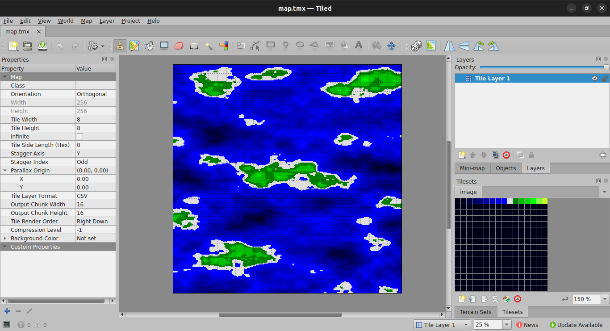

# Perlin Noise Map Generator for Tiled Map Editor

## Description

VGS-Zero のパーリンノイズの実装を使って地形データを [Tiled Map Editor](https://www.mapeditor.org/) で使えるマップデータ形式（tmx）で出力するツールです。

パーリンノイズは HAGe の機能として使うこともできますが、パーリンノイズで生成したマップデータを加工して利用したい時には本ツールを使うと便利かもしれません。

本ツールは Ubuntu Linux で利用できます。

## How to Build

```bash
sudo apt install build-essential
sudo snap install tiled
make
```

## Usage

```
pn2tmx [-s シード値] ※省略時: 0
       [-x X座標の縮尺] ※省略時: 64
       [-y X座標の縮尺] ※省略時: 64
       [-o オクターブ値] ※省略時: 0 (オクターブ無しのノイズ)
       [-w 生成マップの幅] ※省略時: 128
       [-h 生成マップの高さ] ※省略時: 128
       [-d パターン除算値] ※省略時: 1 (1~255)
       [-i イメージファイル名] ※省略時: image.bmp
       [-t tsxファイル名] ※省略時: image.tsx
```

## Test

```bash
make test
```

`make test` を実行すると次のコマンドラインを実行して `map.tmx` を生成して Tiled Map Editor で開きます。

```bash
./pn2tmx -d 16 -o 5 -s 555 -w 256 -h 256 -x 48 -y 48 > map.tmx
```



## Licnese

[GPLv3](./LICENSE.txt)
